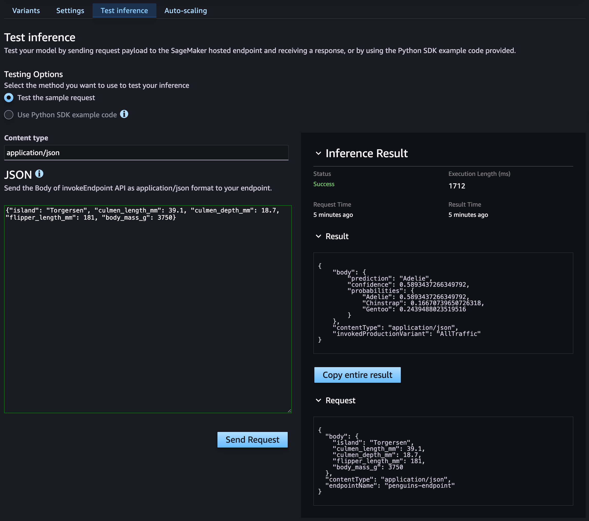

# MLOps on Sagemaker

Building an end-to-end ML Pipeline on AWS Sagemaker.

## Setup

Install [`uv`](https://docs.astral.sh/uv/getting-started/installation/) before running.

- If you are using AWS SSO, you can activate your profile by running the following command:

    ```bash
    # AWS_PROFILE=sandbox
    aws configure sso --profile sandbox
    # OR
    aws sso login --profile sandbox
    ```

- Setup Infra
    ```bash
    # Bootstrap the CDK environment
    ./run cdk-bootstrap

    # Deploy the CDK stack
    # This will create the S3 bucket and SageMaker domain
    ./run cdk-deploy
    ```

- Create a `.env` file based on the `env.example` file and fill in the required values.

- Clean Up
    ```bash
    # Destroy infra
    ./run cdk-destroy

    # Clean up local files
    ./run clean
    ```

## Usage

-  Run the Pipeline:
    ```bash
    # to run the pipeline with SageMaker
    ./run pipeline

    # to run the pipeline locally
    ./run pipeline --local
    ```

    

- Test the endpoint:
    ```bash
    AWS_PROFILE=sandbox uv run scripts/test_endpoint.py
    ```

    ```bash
    Single penguin data:
    {
        "island": "Torgersen",
        "culmen_length_mm": 39.1,
        "culmen_depth_mm": 18.7,
        "flipper_length_mm": 181,
        "body_mass_g": 3750
    }

    Response status: 200
    Result: {
        'prediction': 'Adelie',
        'confidence': 0.5893437266349792,
        'probabilities': {
            'Adelie': 0.5893437266349792,
            'Chinstrap': 0.16670739650726318,
            'Gentoo': 0.2439488023519516
        }
    }
    ```

    

## Contributing

If you find any problems with the code or have any ideas on improving it, please open an issue and share your recommendations.
